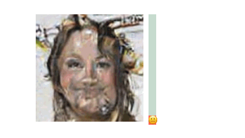

<div align="center"> <div style="display: flex; justify-content: center; margin-bottom: 20px;">  </div> <h1>COIND: ENABLING LOGICAL COMPOSITIONS IN DIFFUSION MODELS</h1> <p style="font-size:1.2em"> <a href="http://sachit3022.github.io"><strong>Sachit Gaudi</strong></a>· <a href="https://scholar.google.com/citations?user=mBrW_AkAAAAJ&hl=en&oi=ao"><strong>Gautam Sreekumar</strong></a>· <a href="https://scholar.google.com/citations?user=JKcrO9IAAAAJ&hl=en"><strong>Vishnu Boddeti</strong></a> <br> Michigan State University <br> <a href="https://openreview.net/forum?id=cCRlEvjrx4"><strong>ICLR 2025</strong></a> </p> </div>


<table>
  <tr>
    <td></td>
    <td></td>
    <td></td>
    <td></td>
  </tr>
  <tr>
    <td><p align="center">Dataset present in nature where C<sub>1</sub>,C<sub>2</sub> are independent gaussian denoted on the respective axis.</td>
    <td><p align="center">Orthogonal Support (only few compositions seen in training)</p></td>
    <td><p align="center">Diffusion Model with CoInD generates unseen compositions</p></td>
    <td><p align="center">Vanilla Diffusion Models generate incorrect interpolations</p></td>
  </tr>
</table>

Complete walk through of the CoInD along with theoritical derivation for 2d gaussian is avaiable at [notebooks/2d_gaussian_generation.ipynb](notebooks/2d_gaussian_generation.ipynb)

### CoInD generates unseen compositions with precise control over attributes smile, and gender.
<table> <tr> <th style="width:100px; text-align:right; padding-right:10px;">CoInD</th> <td></td> <td></td> <td></td> <td></td> </tr> <tr> <th style="width:100px; text-align:right; padding-right:10px;">LACE</th> <td></td> <td></td> <td></td> <td></td> </tr> <tr> <th style="width:100px; text-align:right; padding-right:10px;">Composed GLIDE</th> <td></td> <td></td> <td></td> <td></td> </tr> </table>

For large vision dataset we give a sofisticated code where you can train large model on multiple GPUs. 
This repository is built on very cool, config management system called Hydra. Training from pytorch lightning, and model architectures from huggingface.
### Installation
```bash
git clone https://github.com/sachit3022/compositional-generation.git
cd compositional-generation
conda env create -f environment.yml
conda activate compositional-generation
```
### Download the datasets
- ColoredMNIST, Shapes3D will be automatically downloaded when you first call the training
- CelebA: Please refer to CelebA instructions to download the datasets.

Add the download location to the respective file in configs/datasets/*.yaml

## Training

### Classifier for Confirmity score
To measure the faithfullness of the generation we have introduced confirmity score, refer to Appendix of the paper.
```bash
python coind/cs_classifier/train.py --config-name=cs_cmnsit
```
### Diffusion in Latent Space
For CelebA dataset, we perform diffusion on Latent space. To speed up the training process run generation on the latent space. ( we borrow this from fast-DiT ) 
```bash
CUDA_VISIBLE_DEVICES=0 torchrun --master_port=25670 coind/scripts/save_latent.py --encoder=vae --image-size=128 --dataset=celeba --data-path=/path/to/celeba --features-path=data/celeba
```

### Train Diffusion model
Modify the config of datasets( add /path/to/your/dataset) and callbacks CS(/path/to/your/checkpoint) or you can remove the callback. 
Example script to run the training based on the dataset setup and the CoInD regularizer.
```bash
python coind/train.py --config-name=cmnist dataset=cmnist_partial diffusion.lambda_coind=1.0
```
This will create a folder called outputs/ and you can monitor the training via tensorboard or CSV generated in the output folder.

### Inference
For Cmnist, CelebA datasets Once trained is completed, evaltion code is provided in the evaluate/ folder to find all the evaluation scripts. 
For CelebA first you have call the generate samples, which would generate samples, To evaluate CS and FID, refer to evaluate script in the evaluate/
If you donot want to train, we provide all the results along with te checkpoint in the follwing spreadsheet. You can download the checkpoint and evaluate.

 <a href="https://docs.google.com/spreadsheets/d/1lHcqRJTo6JgRHh_PwHbt3MIp-PmSKPnqU4wTS9YXB8M/edit?usp=sharing">https://docs.google.com/spreadsheets/d/1lHcqRJTo6JgRHh_PwHbt3MIp-PmSKPnqU4wTS9YXB8M/edit?usp=sharing</a> </p> </div>

For celeba, you can explore the precise control by downloading the checkpoints from the above google sheets, and run  [notebooks/celeba_control_smile.ipynb](notebooks/celeba_control_smile.ipynb)


#### Evaluation
Detail description of the metrics is provided in the paper.
- JSD
- Confirmity Score
- R2 Score
- Diversity
- FID
- Qualitative evaluations


### Custom Datatset, logic, constraints

To train on custom dataset follow our guide
#write a train_dataset and place it in the datasets/ folder

Checkout score/sampling.py file it is built on 


### Scripts for finetuning Stable Diffusion with CoInD

| CoInD |  |  |  |
|-------|----------------------------|----------------------------|----------------------------|
| Composed GLIDE |  |  |  |

Code for finetuning scripts is available in sd_finetune_coind/ Most of it is borrowed from the huggingface finetuning scripts.

### CoInD 🤝 🤗

Coming soon ..... 

### We borrow code from multiple resources, attribution is given in the code.
Special mention to Mushrur, huggingface, hydra, pytorch lightning, lucidrains.


### Utilty of CoInD
ICLRW Synthetic data workshop: Compositional World Knowledge leads to High Utility Synthetic data
To run the code follow the process above, the only change will be in the evaluation on Compositional Generalization task
```bash
python /coind/evaluate/evaluate_synthetic_data.py --sythetic_data_path=/path/to/synthetic_data --sythetic_data_path=/path/to/originaldata --train_on=synthetic 
```

### Citation

If you find our work useful in your research, please consider starring the repo and citing:

```Bibtex
@inproceedings{gaudi2025coind,
   title={{CoInD: Enabling logical compositions in diffusion models}},
   author={Gaudi Sachit, Sreekumar Gautam, Boddeti Vishnu},
   booktitle={ICLR},
   year={2025}
}
```
For questions, feel free to post here or drop an email to this address- gaudisac@msu.edu
