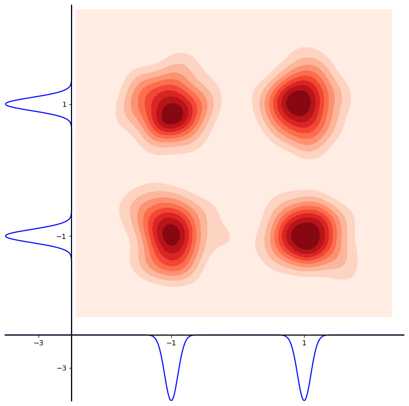
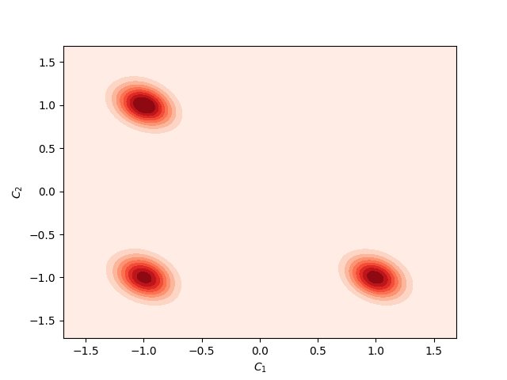
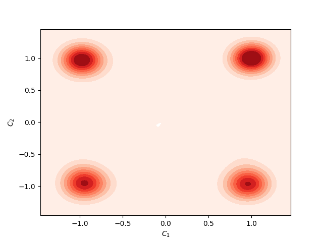
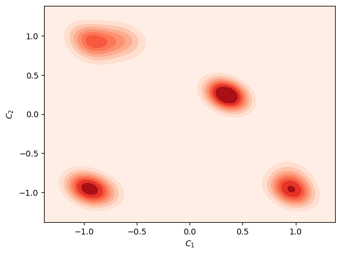

<div align="center">

# COIND: ENABLING LOGICAL COMPOSITIONS IN DIFFUSION MODELS

   <p style="font-size:1.2em">
      <a href="http://sachit3022.github.io"><strong>Sachit Gaudi</strong></a>·
      <a href="https://scholar.google.com/citations?user=mBrW_AkAAAAJ&hl=en&oi=ao"><strong>Gautam Sreekumar</strong></a>·
      <a href="https://scholar.google.com/citations?user=JKcrO9IAAAAJ&hl=en"><strong>Vishnu Boddeti</strong></a>
      <br>
      Michigan State University
      <br>
      <a href="https://openreview.net/forum?id=cCRlEvjrx4"><strong>ICLR 2025</strong></a>
</div>
   </p>


<table>
  <tr>
    <td></td>
    <td></td>
    <td></td>
    <td></td>
  </tr>
  <tr>
    <td><p align="center">Dataset present in nature where C<sub>1</sub>,C<sub>2</sub> are independent gaussian denoted on the respective axis.</td>
    <td><p align="center">Orthogonal Support (only few compositions seen in training)</p></td>
    <td><p align="center">Diffusion Model with CoInD generates unseen compositions</p></td>
    <td><p align="center">Vanilla Diffusion Models generate incorrect interpolations</p></td>
  </tr>
</table>


Complete walk through of the CoInD along with theoritical derivation for 2d gaussian is avaiable at [notebooks/2d_gaussian_generation.ipynb](notebooks/2d_gaussian_generation.ipynb)

For large vision dataset we give a sofisticated code where you can train large model on multiple GPUs
### Installation
```bash
git clone https://github.com/sachit3022/compositional-generation.git
cd compositional-generation
conda env create -f environment.yml
conda activate compositional-generation
```
### Download the datasets
- Shapes3D
- CelebA
This repository is built on very cool, config management system called Hydra. Add the download location to the respective file in configs/datasets/*.yaml

## Training

### Classifier for Confirmity score
To measure the faithfullness of the generation we have introduced confirmity score, refer to Appendix of the paper.
```bash
python coind/cs_classifier/train.py
```
### Diffusion in Latent Space
For CelebA dataset, we perform diffusion on Latent space. To speed up the training process run generation on the latent space. ( we borrow this from fast-DiT ) 
```bash
torchrun --master_port=25670 coind/scripts/save_latent.py --encoder=vae --dataset=celeba --data-path=/path/to/celeba/ --features-path=data/celeba
```
### Train Diffusion model
Modify the config of datasets( add /path/to/your/dataset) and callbacks CS(/path/to/your/checkpoint) or you can remove the callback. 
Example script to run the training based on the dataset setup and the CoInD regularizer.
```bash
python coind/train.py --config-name=cmnist dataset=cmnist_partial diffusion.lambda_coind=1.0
```
This will create a folder called outputs/ and you can monitor the training via tensorboard or CSV generated in the output folder.

### Inference
Once trained upload the checkpoint to checkpoints repository or download our checkpoints and place them in the checkpoints repository.

#### Evaluation
Detail description of the metrics is provided in the paper.
- JSD
- Confirmity Score
- R2 Score
- Diversity
- FID

#### Generate 
To have the guide to custom logical queries and fine grained control refer to our notbook.
### Custom dataset
To train on custom dataset follow our guide
#write a train_dataset and place it in the datasets/ folder


### Scripts for finetuning Stable Diffusion with CoInD

Coming soon ..... 

### CoInD 🤝 🤗

Coming soon ..... 

### Utilty of CoInD
ICLRW Synthetic data workshop: Compositional World Knowledge leads to High Utility Synthetic data
To run the code follow the process above, the only change will be in the evaluation on Compositional Generalization task
```bash
python /coind/evaluate/evaluate_synthetic_data.py --sythetic_data_path=/path/to/synthetic_data --sythetic_data_path=/path/to/originaldata --train_on=synthetic 
```

### Citation

If you find our work useful in your research, please consider starring the repo and citing:

```Bibtex
@inproceedings{gaudi2025coind,
   title={{CoInD: Enabling logical compositions in diffusion models}},
   author={Gaudi Sachit, Sreekumar Gautam, Boddeti Vishnu},
   booktitle={ICLR},
   year={2025}
}
```
For questions, feel free to post here or drop an email to this address- gaudisac@msu.edu
